

   

<h2> Want to know more about me? 🙋</h2>
<h4>🌱 I love reading, walking, having a good coffee with a friend, and watching bad movies with my brother.</h4>
<h4>🌱 I’m currently working in amazing projects.</h4>
<h4>🌱 I’m on <a href='https://www.linkedin.com/in/estefan%C3%ADa-m%C3%A1rquez-137b45175/' target='_blank'>LinkedIn</a> feel free to connect!!</h4>
<h4>🌱 I’m always open to new challenges that help me grow as a developer and as a person.</h4>

<h2> Skills  </h2>

<svg aria-label="Vercel logotype" height="64" role="img" viewBox="0 0 283 64" width="283"><path d="M141.68 16.25c-11.04 0-19 7.2-19 18s8.96 18 20 18c6.67 0 12.55-2.64 16.19-7.09l-7.65-4.42c-2.02 2.21-5.09 3.5-8.54 3.5-4.79 0-8.86-2.5-10.37-6.5h28.02c.22-1.12.35-2.28.35-3.5 0-10.79-7.96-17.99-19-17.99zm-9.46 14.5c1.25-3.99 4.67-6.5 9.45-6.5 4.79 0 8.21 2.51 9.45 6.5h-18.9zm117.14-14.5c-11.04 0-19 7.2-19 18s8.96 18 20 18c6.67 0 12.55-2.64 16.19-7.09l-7.65-4.42c-2.02 2.21-5.09 3.5-8.54 3.5-4.79 0-8.86-2.5-10.37-6.5h28.02c.22-1.12.35-2.28.35-3.5 0-10.79-7.96-17.99-19-17.99zm-9.45 14.5c1.25-3.99 4.67-6.5 9.45-6.5 4.79 0 8.21 2.51 9.45 6.5h-18.9zm-39.03 3.5c0 6 3.92 10 10 10 4.12 0 7.21-1.87 8.8-4.92l7.68 4.43c-3.18 5.3-9.14 8.49-16.48 8.49-11.05 0-19-7.2-19-18s7.96-18 19-18c7.34 0 13.29 3.19 16.48 8.49l-7.68 4.43c-1.59-3.05-4.68-4.92-8.8-4.92-6.07 0-10 4-10 10zm82.48-29v46h-9v-46h9zM37.59.25l36.95 64H.64l36.95-64zm92.38 5l-27.71 48-27.71-48h10.39l17.32 30 17.32-30h10.39zm58.91 12v9.69c-1-.29-2.06-.49-3.2-.49-5.81 0-10 4-10 10v14.8h-9v-34h9v9.2c0-5.08 5.91-9.2 13.2-9.2z" fill="black"></path></svg>

## 📌 My Projects
### <a href='https://app.agenddo.com/' target='_blank'>Agenddo</a> 
This web app offers to single professionals, so as to consolidated establishments, a practical and quick way to mount their own web site and organize their business.

Technologies:

 HTML | CSS | JavaScript | React | Redux | MUI | Node.js | Express.js | MongoDB-Atlas/Mongoose | AWS | Hostinger | Bcrypt | JSONWebToken | Nodemailer | OAuth 2.0 | CheckoutAPI Mercadopago | Mobbex API | Ultramsg API | Cloudinary | Notion

 

The website allows you to: 

✅ Upload all the relevant data of the services you offer to a personalized store that you can share with your clients.

✅ Have your clients hiring your services from the website, with online payments.

✅ Load all the appointments you want, from your personal account, to keep the availability control updated with the appointments not arranged online.

✅ Forget about reminding your clients of their appointments, with automated WhatsApp reminders when creating, modifying or canceling appointments.

 

      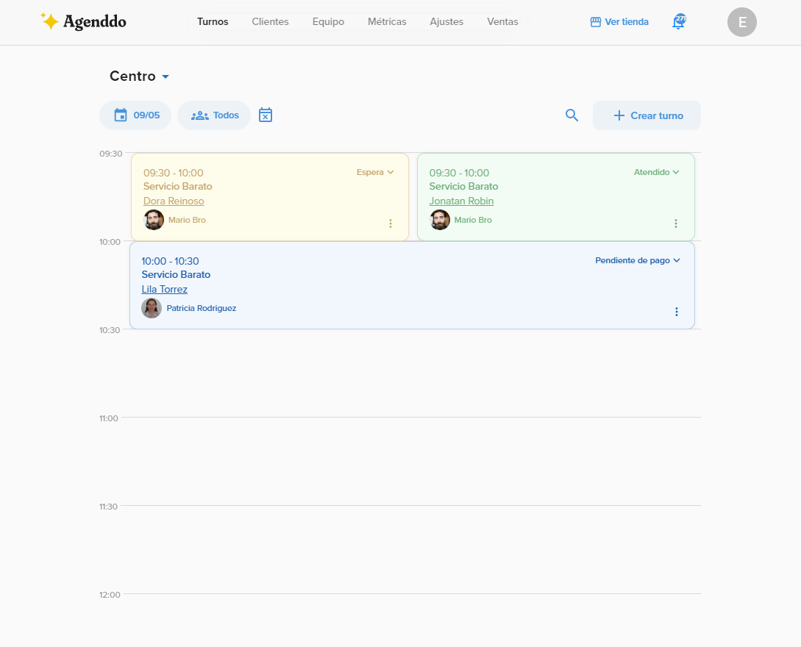
      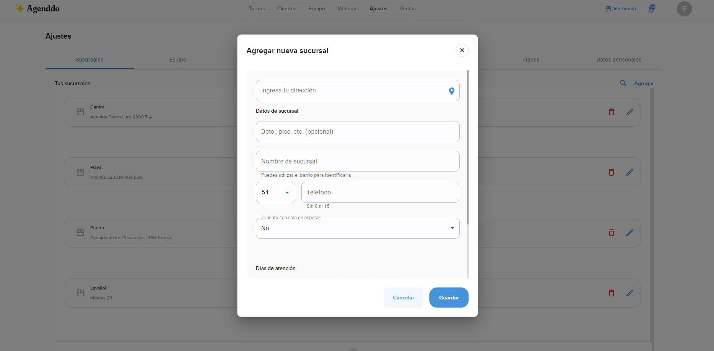
      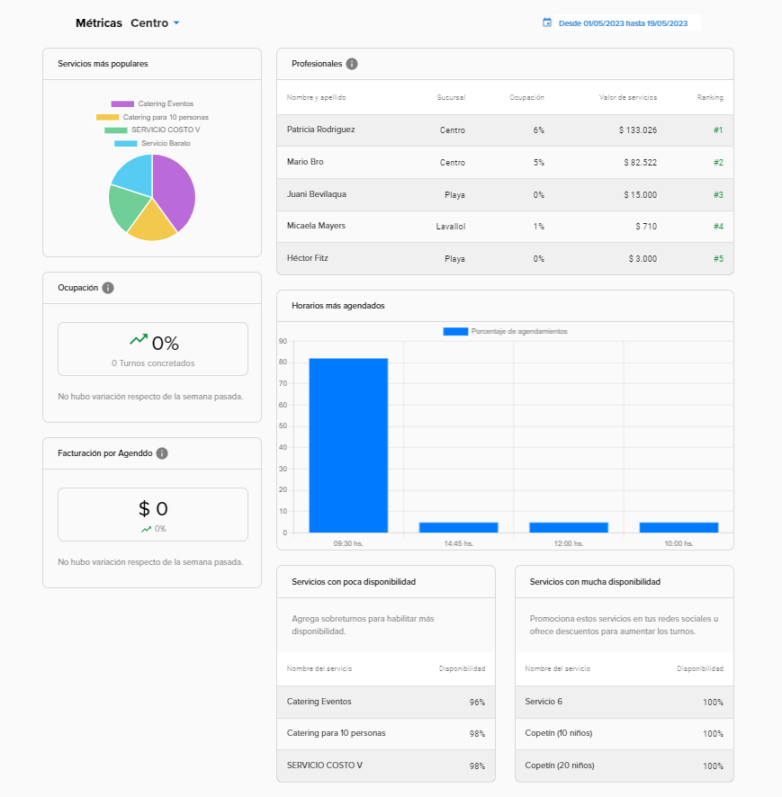
      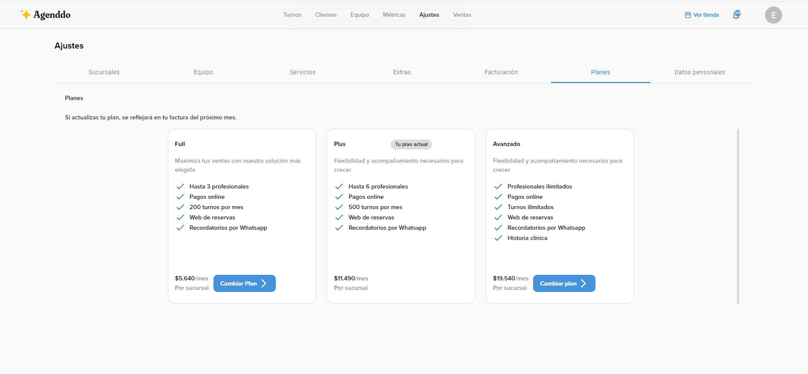
      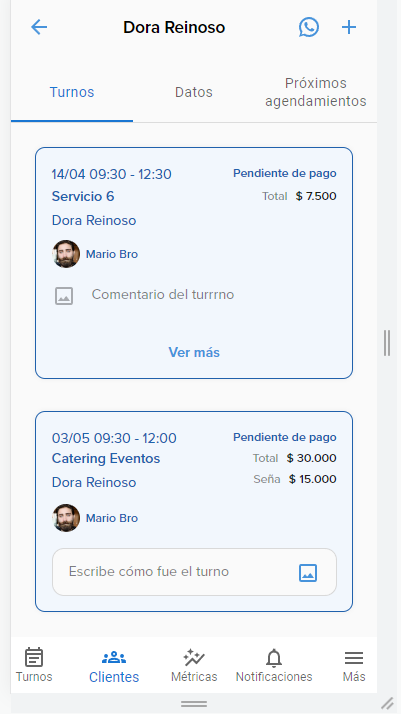
      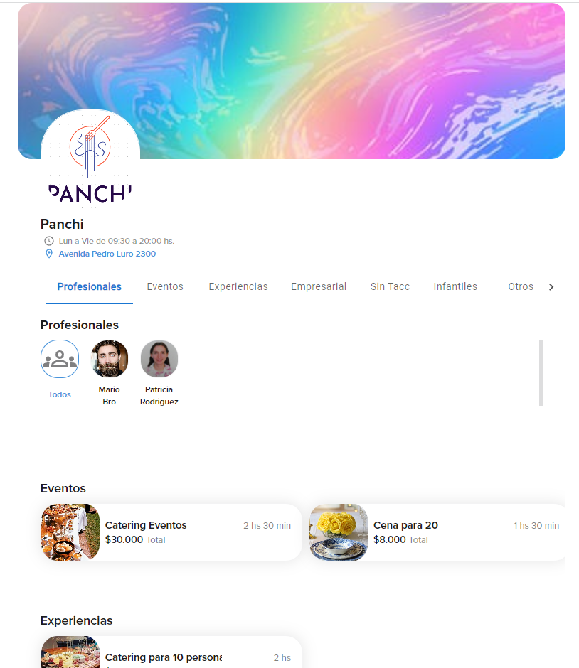
      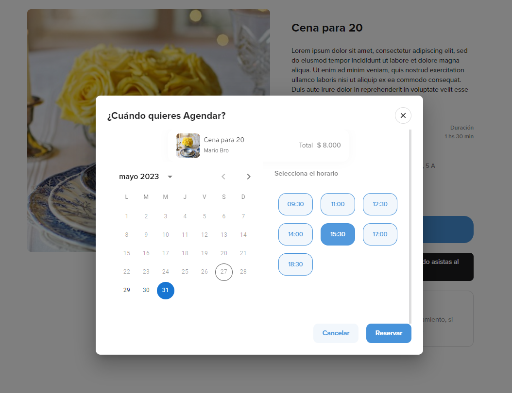

### <a href='https://snor-inn.vercel.app/' target='_blank'>Snor-Inn</a> 
SnorInn is a Single Page Application (SPA) developed using agile software methodologies (SCRUM), with one-week-long sprints. This web app offers the possibility to connect all those who have a space or place intended to host tourists (be they: in houses, hotels, hostels, bed and breakfast...), and those tourists who want to find their best place to rest.

Technologies:

 HTML | CSS | Bootstrap | TypeScript | React | Redux Toolkit |  Node.js | Express.js | MongoDB-Atlas/Mongoose | Bcrypt | JSONWebToken | Nodemailer | Google-auth-library | Stripe | Cloudinary | Trello

 

The website allows you to: 

✅ View all rooms, filter them by location, type and n° of beds, search them by name, sort them by price and rating.

✅ Register as a rooms admin to create and manage your rooms.

✅ Register as client and select rooms as your favorites, make reservations by date and pay online, manage those reservations and add reviews to the rooms you've reserved.

⮞<a href='https://www.youtube.com/watch?v=bexF7X7p5fY' target='_blank'>📹Watch Demo</a>

### <a href='https://pi-pokemon-bice.vercel.app/' target='_blank'>Poke App</a> 
This Single Page Application lets you search through the first generation first 40 pokemons through the use of an external API. You can sort them alphabetically, or by their attack; you can also filter them either by one type or by origin - meaning, those brought by the API or created with the use of a controlled form.
The search bar lets you navigate between pokemons by name, and by clicking in one of them the user can take a look at a detail page witch shows you the pokemon in movement and more information than the displayed in the principal page.

Technologies:

HTML | CSS | JavaScript | React | Redux | Node.js | Express.js | SQL-PostgreSQL/Sequelize

 

      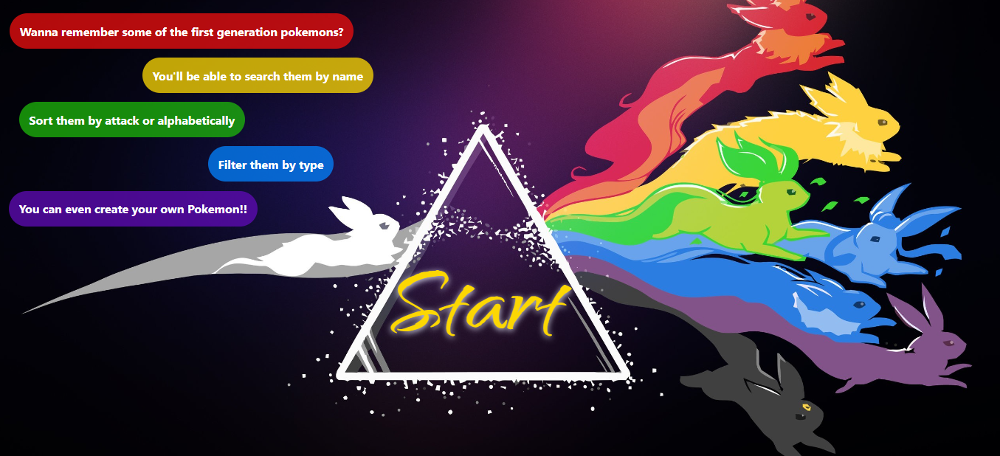
      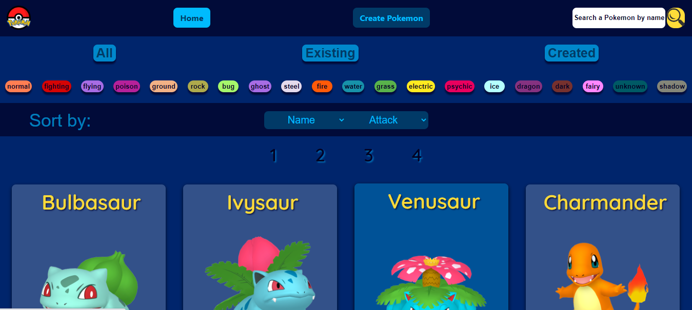
      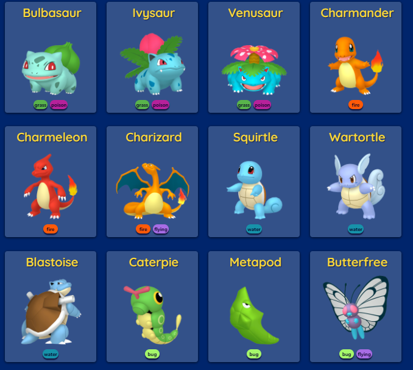
      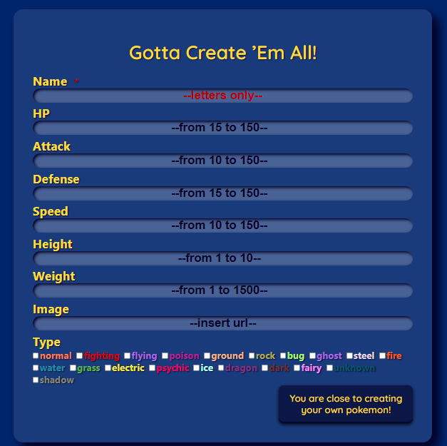
      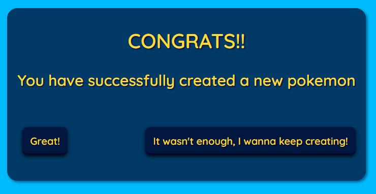
      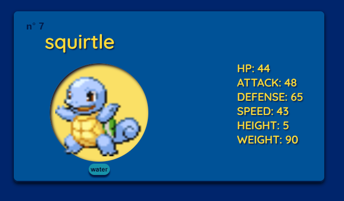

##  My GitHub Activity 

 
 
